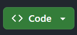
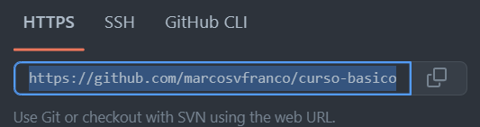

# Instalação do Typescript

Para executarmos nosso projeto precisaremos do Typescript instalado. Existe uma extensão para o VSCode que já faz isso. Para isso acesse o link abaixo e instale a extensão caso você já não a tenha instalado:

https://marketplace.visualstudio.com/items?itemName=ms-vscode.vscode-typescript-next

---

# Instalação do projeto base

Após a instalacao dos softwares necessarios vamos configurar o projeto base do Playwright, vamos instalar a base do nosso projeto:

- Clone o repositorio seguinte para sua maquina: https://github.com/marcosvfranco/curso-basico-playwright-pub

  - Clique no botão verde `Code`  

  - Clique no botão a direita do link exibido para copiar o link  

  - Abra o seu terminal Git Bash ou outro de sua preferencia na pasta que quer clonar o repositório e escreva `git clone  ` e copie o valor da URL
  - Ficará assim: `git clone https://github.com/marcosvfranco/curso-basico-playwright-pub`
  - Aperte Enter

Pronto, agora vamos instalar o projeto

- Execute o comando `npm i`
- Agora execute o comando `npx playwright install`

Perfeito! Agora temos nosso projeto instalado pronto para podermos começar o curso

---

## Observações

A documentação oficial do Playwright nos diz para usar o comando `npm init playwright@latest` para instalar o projeto, mas como queremos focar na versão específica `1.38.1` do Playwright neste curso, não vamos usar esse comando pois ele instala o Playwright na sua última versão.

---

## Documentação do Playwright

A documentação oficial para a instalação do Playwright está neste link  
https://playwright.dev/docs/intro
